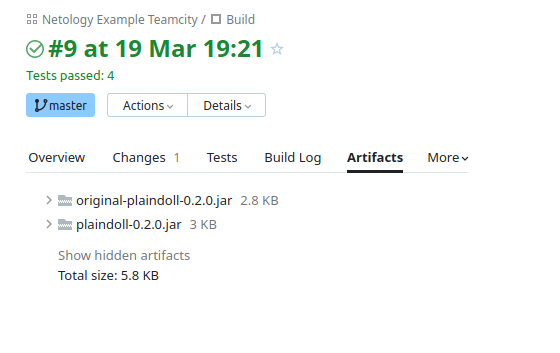

# Домашнее задание к занятию "09.04 Teamcity"

## Модуль 9. Система управления конфигурациями

### Студент: Иван Жиляев

## Подготовка к выполнению

>1. Поднимите инфраструктуру [teamcity](./teamcity/docker-compose.yml)

Сервис удалось запустить после изменения владельца папки на которую ссылается том:

```
sudo chown -R 1000:1000 temp_volumes/
```

>2. Если хочется, можете создать свою собственную инфраструктуру на основе той технологии, которая нравится. Инструкция по установке из [документации](https://plugins.jetbrains.com/plugin/9017-ansible-runner)
>3. Дождитесь запуска teamcity, выполните первоначальную настройку
>4. Авторизуйте агент
>5. Сделайте fork [репозитория](https://github.com/aragastmatb/example-teamcity)

Форк доступен по [ссылке](https://github.com/nimlock/netology-example-teamcity).

## Основная часть

>1. Создайте новый проект в teamcity на основе fork
>2. Сделайте autodetect конфигурации
>3. Сохраните необходимые шаги, запустите первую сборку master'a
>4. Поменяйте условия сборки: если сборка по ветке `master`, то должен происходит `mvn clean package`, иначе `mvn clean test`

Необходимые условия можно установить в свойствах каждого шага сборки в разделе _Execute step_.

>5. Мигрируйте `build configuration` в репозиторий

Миграция никак не происходила, причина осталась неизвестна. На лекции было сказано, что конфигурация попадёт в удаленный репозиторий после запуска сборки, но это не помогало. Также не помогали различные настройки, при этом сама конфигурация сборки была в read-only режиме.  
Успешная комбинация: включил новый UI Teamcity, после чего выключил и заново включил синхронизацию - настройки тут же были закачаны в репозиторий.

>6. Создайте отдельную ветку `feature/add_reply` в репозитории
>7. Напишите новый метод для класса Welcomer: метод должен возвращать произвольную реплику, содержащую слово `hunter`
>8. Дополните тест для нового метода на поиск слова `hunter` в новой реплике
>9. Сделайте push всех изменений в новую ветку в репозиторий
>10. Убедитесь что сборка самостоятельно запустилась, тесты прошли успешно
>11. Внесите изменения из произвольной ветки `feature/add_reply` в `master` через `Merge`
>12. Убедитесь, что нет собранного артефакта в сборке по ветке `master`
>13. Настройте конфигурацию так, чтобы она собирала `.jar` в артефакты сборки

Настройку сделал, артефакты собираются:  


>14. Проведите повторную сборку мастера, убедитесь, что сбора прошла успешно и артефакты собраны
>15. Проверьте, что конфигурация в репозитории содержит все настройки конфигурации из teamcity

Конфигурация обновилась как и ожидалось.

>16. В ответ предоставьте ссылку на репозиторий

[Ссылка](https://github.com/nimlock/netology-example-teamcity) на репозиторий.
