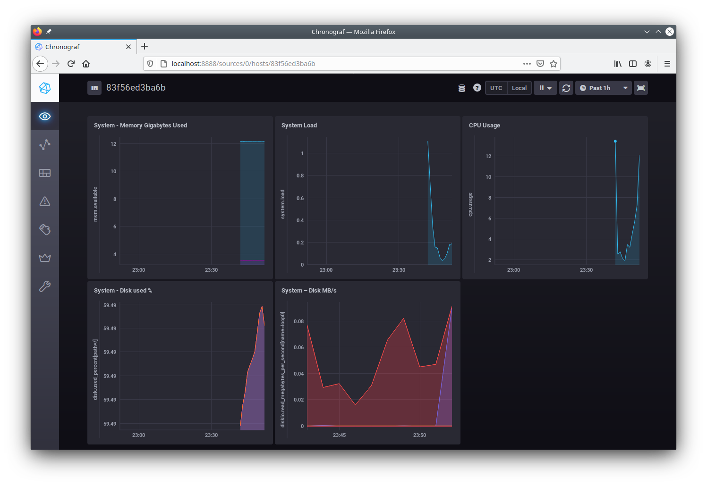
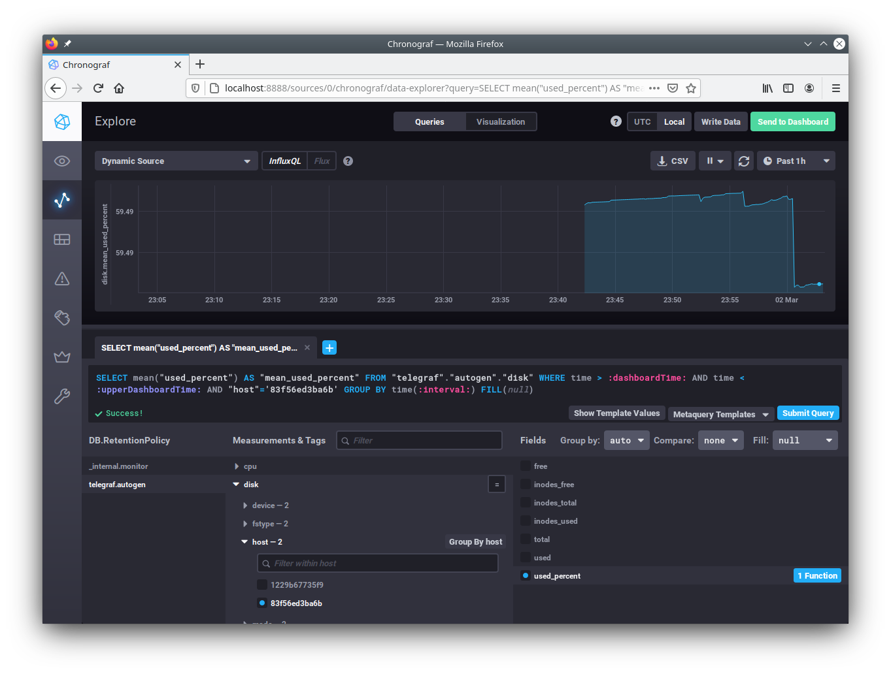
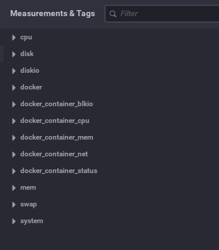

# Домашнее задание к занятию "10.02. Системы мониторинга"

## Модуль 10. Системы мониторинга

### Студент: Иван Жиляев

## Обязательные задания

>1. Опишите основные плюсы и минусы pull и push систем мониторинга.

Основным плюсом pull-модели является надёжность доставки данных от агента ядру системы мониторинга. Также может оказаться полезной возможность рассчитывать значения каких-либо комплексных метрик на самом агенте, а в ядро отправлять лишь результат вычислений метрики.

Минус pull-модели - нет "настоящих" on-line данных из-за интервальности их получения.

Push-системы хороши своей оперативностью предоставления данных, но допускается риск нарушения полноты данных из-за проблем в сети при использовании UDP-протокола. Дополнительные плюсы: возможность дублирования данных в разные системы мониторинга, индивидуальная настройка периодичности отправки данных и их содержания. 

>2. Какие из ниже перечисленных систем относятся к push модели, а какие к pull? А может есть гибридные?
>
>    - Prometheus 
>    - TICK
>    - Zabbix
>    - VictoriaMetrics
>    - Nagios


- Prometheus - pull-модель, хотя при необходимости можно использовать push-модуль [Prometheus Pushgateway](https://github.com/prometheus/pushgateway)
- TICK - поставляется с push-моделью, но может быть настроен как pull
- Zabbix - гибридный вариант, обеспечивается активным и пассивным режимами работы агентов
- VictoriaMetrics - гибридный вариант, это видно на первой схеме в [описании vmagent](https://victoriametrics.github.io/vmagent.html) - агента этой системы
- Nagios - также гибрид, NCPA Agent может работать как в активном, так и в пассивном режимах


>3. Склонируйте себе [репозиторий](https://github.com/influxdata/TICK-docker/tree/master/1.3) и запустите TICK-стэк, 
>используя технологии docker и docker-compose.
>
>В виде решения на это упражнение приведите выводы команд с вашего компьютера (виртуальной машины):
>
>    - curl http://localhost:8086/ping
>    - curl http://localhost:8888
>    - curl http://localhost:9092/kapacitor/v1/ping
>
>А также скриншот веб-интерфейса ПО chronograf (`http://localhost:8888`). 
>
>P.S.: если при запуске некоторые контейнеры будут падать с ошибкой - проставьте им режим `Z`, например
>`./data:/var/lib:Z`

Выводы команд:

- curl -I http://localhost:8086/ping
  ```
  ivan@kubang:~$ curl -I http://localhost:8086/ping
  HTTP/1.1 204 No Content
  Content-Type: application/json
  Request-Id: 01df1ec4-7abf-11eb-8065-0242ac130002
  X-Influxdb-Build: OSS
  X-Influxdb-Version: 1.7.10
  X-Request-Id: 01df1ec4-7abf-11eb-8065-0242ac130002
  Date: Mon, 01 Mar 2021 18:50:35 GMT
  ```

- curl http://localhost:8888
  ```
  ivan@kubang:~$ curl http://localhost:8888
  <!DOCTYPE html><html><head><meta http-equiv="Content-type" content="text/html; charset=utf-8"><title>Chronograf</title><link rel="shortcut icon" href="/favicon.fa749080.ico"><link rel="stylesheet" href="/src.3999f023.css"></head><body> <div id="react-root" data-basepath=""></div> <script src="/src.2f700edb.js"></script>
  </body></html>
  ```

- curl -I http://localhost:9092/kapacitor/v1/ping
  ```
  ivan@kubang:~$ curl -I http://localhost:9092/kapacitor/v1/ping
  HTTP/1.1 204 No Content
  Content-Type: application/json; charset=utf-8
  Request-Id: 1dc9146b-7abf-11eb-80d7-000000000000
  X-Kapacitor-Version: 1.5.8
  Date: Mon, 01 Mar 2021 18:51:22 GMT
  ```

Скриншот Chronograf:  


>4. Перейдите в веб-интерфейс Chronograf (`http://localhost:8888`) и откройте вкладку `Data explorer`.
>
>    - Нажмите на кнопку `Add a query`
>    - Изучите вывод интерфейса и выберите БД `telegraf.autogen`
>    - В `measurments` выберите mem->host->telegraf_container_id , а в `fields` выберите used_percent. 
>    Внизу появится график утилизации оперативной памяти в контейнере telegraf.
>    - Вверху вы можете увидеть запрос, аналогичный SQL-синтаксису. 
>    Поэкспериментируйте с запросом, попробуйте изменить группировку и интервал наблюдений.
>
>Для выполнения задания приведите скриншот с отображением метрик утилизации места на диске 
>(disk->host->telegraf_container_id) из веб-интерфейса.

Скриншот Chronograf №2:  


>5. Изучите список [telegraf inputs](https://github.com/influxdata/telegraf/tree/master/plugins/inputs). 
>Добавьте в конфигурацию telegraf следующий плагин - [docker](https://github.com/influxdata/telegraf/tree/master/plugins/inputs/docker):
>```
>[[inputs.docker]]
>  endpoint = "unix:///var/run/docker.sock"
>```
>
>Дополнительно вам может потребоваться донастройка контейнера telegraf в `docker-compose.yml` дополнительного volume и 
>режима privileged:
>```
>  telegraf:
>    image: telegraf:1.4.0
>    privileged: true
>    volumes:
>      - ./etc/telegraf.conf:/etc/telegraf/telegraf.conf:Z
>      - /var/run/docker.sock:/var/run/docker.sock:Z
>    links:
>      - influxdb
>    ports:
>      - "8092:8092/udp"
>      - "8094:8094"
>      - "8125:8125/udp"
>```
>
>После настройке перезапустите telegraf, обновите веб интерфейс и приведите скриншотом список `measurments` в 
>веб-интерфейсе базы telegraf.autogen . Там должны появиться метрики, связанные с docker.
>
>Факультативно можете изучить какие метрики собирает telegraf после выполнения данного задания.

Скриншот Chronograf №3:  


## Дополнительное задание (со звездочкой*) - необязательно к выполнению

>В веб-интерфейсе откройте вкладку `Dashboards`. Попробуйте создать свой dashboard с отображением:
>
>    - утилизации ЦПУ
>    - количества использованного RAM
>    - утилизации пространства на дисках
>    - количество поднятых контейнеров
>    - аптайм
>    - ...
>    - фантазируйте)
