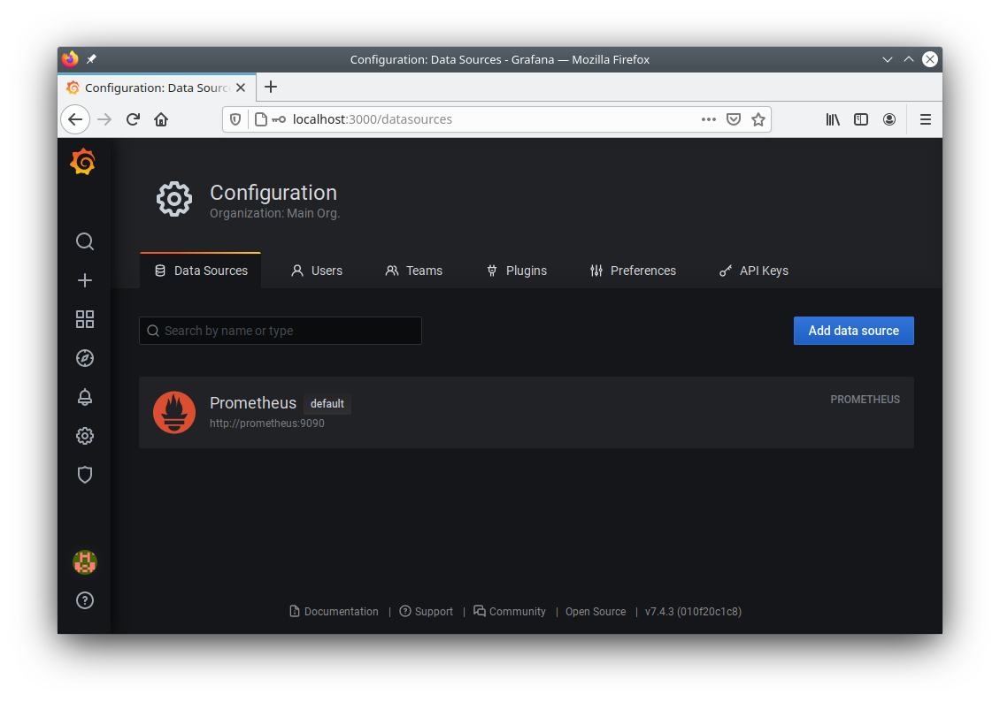
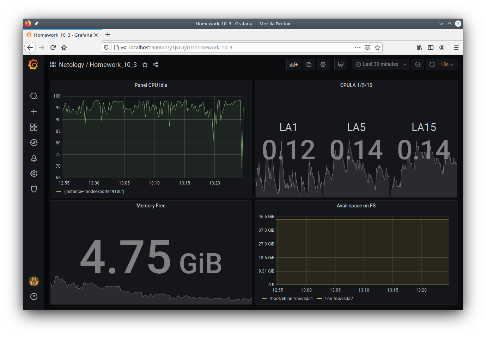
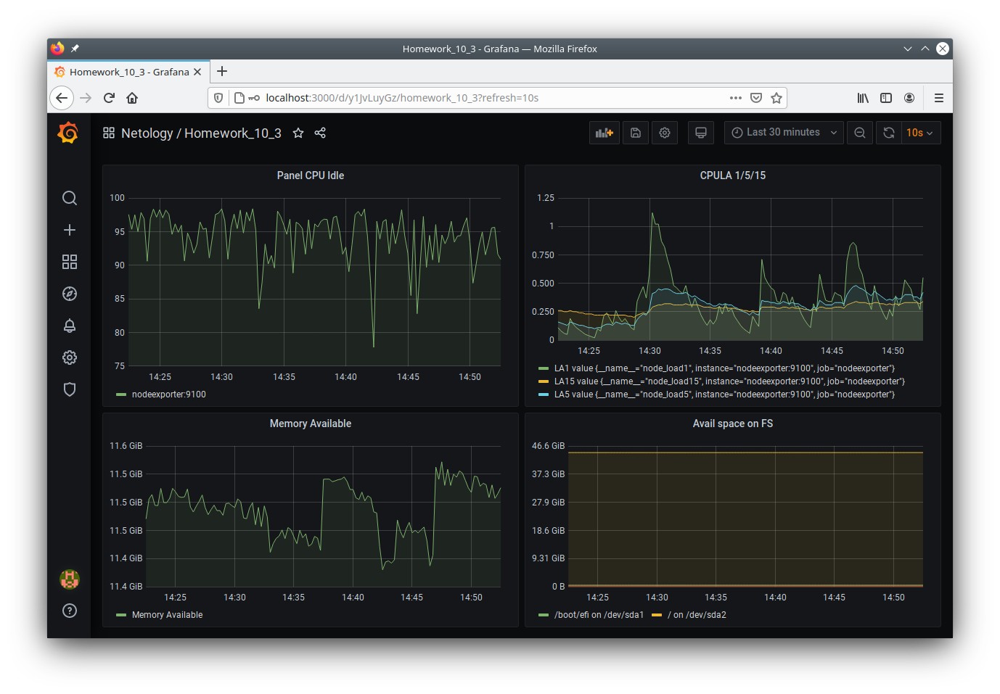

# Домашнее задание к занятию "10.03. Grafana"

## Модуль 10. Системы мониторинга

### Студент: Иван Жиляев

## Задание повышенной сложности

>**В части задания 1** не используйте директорию [help](./help) для сборки проекта, самостоятельно разверните grafana, где в 
>роли источника данных будет выступать prometheus, а сборщиком данных node-exporter:
>- grafana
>- prometheus-server
>- prometheus node-exporter
>
>За дополнительными материалами, вы можете обратиться в официальную документацию grafana и prometheus.
>
>В решении к домашнему заданию приведите также все конфигурации/скрипты/манифесты, которые вы 
>использовали в процессе решения задания.
>
>**В части задания 3** вы должны самостоятельно завести удобный для вас канал нотификации, например Telegram или Email
>и отправить туда тестовые события.
>
>В решении приведите скриншоты тестовых событий из каналов нотификаций.

## Обязательные задания

### Задание 1
>Используя директорию [help](./help) внутри данного домашнего задания - запустите связку prometheus-grafana.
>
>Зайдите в веб-интерфейс графана, используя авторизационные данные, указанные в манифесте docker-compose.
>
>Подключите поднятый вами prometheus как источник данных.
>
>Решение домашнего задания - скриншот веб-интерфейса grafana со списком подключенных Datasource.

Воспользовался подготовленным docker-compose.yml, но немного изменил его.

Скриншот списка Datasource:  


## Задание 2
>Изучите самостоятельно ресурсы:
>- [promql-for-humans](https://timber.io/blog/promql-for-humans/#cpu-usage-by-instance)
>- [understanding prometheus cpu metrics](https://www.robustperception.io/understanding-machine-cpu-usage)
>
>Создайте Dashboard и в ней создайте следующие Panels:
>- Утилизация CPU для nodeexporter (в процентах, 100-idle)
>- CPULA 1/5/15
>- Количество свободной оперативной памяти
>- Количество места на файловой системе
>
>Для решения данного ДЗ приведите promql запросы для выдачи этих метрик, а также скриншот получившейся Dashboard.

Запросы для выдачи метрик:

- Утилизация CPU для nodeexporter (в процентах, 100-idle)

    ```
    avg by (instance) (rate(node_cpu_seconds_total{job="nodeexporter",mode="idle"}[10s])) * 100
    ```

- CPULA 1/5/15

    ```
    node_load1{job="nodeexporter"}
    node_load5{job="nodeexporter"} 
    node_load15{job="nodeexporter"}
    ```

- Количество свободной оперативной памяти

    ```
    node_memory_MemAvailable_bytes{job="nodeexporter"}
    ```

- Количество места на файловой системе

    ```
    node_filesystem_avail_bytes{job="nodeexporter",fstype!~"tmpfs|fuse.lxcfs|fuse.xrdp-chansrv"}
    ```

Скриншот получившейся Dashboard:  


## Задание 3
>Создайте для каждой Dashboard подходящее правило alert (можно обратиться к первой лекции в блоке "Мониторинг").
>
>Для решения ДЗ - приведите скриншот вашей итоговой Dashboard.

С удивлением обнаружил, что alert-ы доступны только для режима визуализации "Graph". Применил его ко всем созданным панелям.

Также по какой-то причине алерт панели "CPULA 1/5/15" выдаёт предупреждение "The datasource does not support alerting queries", хотя на других панелях такого нет.

Алерты создавал со следующей логикой:

- `Утилизация CPU для nodeexporter (в процентах, 100-idle)`:  
    достаточно выбрать пороговое значение и сравнивать метрику с ним; сработка произойдёт при просадке idle менее 10% при агрегации по медианному значению за последние 5 минут

- `CPULA 1/5/15`:  
    сработка нужна когда средняя загрузка процессора выше какого-то процента от количества его потоков. Это значит, что нам необходимо добавить метрику `count (node_cpu_seconds_total{job="nodeexporter",mode="idle"}) * 0.8` - это будет пороговое значение для LA.  
    Для определения наличия проблемы достаточно посчитать отношение значения LAx к пороговому значению и сравнить результат с единицей - если больше единицы, значит порог превышен. К сожалению, комплексная метрика по подсчёту данного отношения не заработала, хотя составляющие её метрики в числителе и знаменателе прекрасно отображалить по отдельности.  
    Для решения проблемы я решил воспользоваться Выражениями для примитивного сравнения текущего значения LAx и порогового значения вида `$node_load1 > $threshold_load_CPU`. На графике Выражения корректно отображаются выводя значение `1` в случае "аварии" и `0` при её отсутствии.
    Лишние метрики скрыл с графика.

- `Количество свободной оперативной памяти`:  
    решил добавить комплексную метрику для расчёта процента доступной памяти - `(node_memory_MemAvailable_bytes{job="nodeexporter"} * 100) / node_memory_MemTotal_bytes{job="nodeexporter"}`. Алерт сработает если данная метрика будет ниже 20% последние 5 минут.

- `Количество места на файловой системе`:  
    также решил добавить метрику в процентном выражении параметра - `100 * node_filesystem_avail_bytes{job="nodeexporter",fstype!~"tmpfs|fuse.lxcfs|fuse.xrdp-chansrv"} / node_filesystem_size_bytes{job="nodeexporter",fstype!~"tmpfs|fuse.lxcfs|fuse.xrdp-chansrv"}`. Алерт сработает если средняя величина данной метрики будет ниже 15% последние 5 минут.

В итоге дашборд переделал до такого состояния:  


## Задание 4
>Сохраните ваш Dashboard.
>
>Для этого перейдите в настройки Dashboard, выберите в боковом меню "JSON MODEL".
>
>Далее скопируйте отображаемое json-содержимое в отдельный файл и сохраните его.
>
>В решении задания - приведите листинг этого файла.

Данные выгрузил в файл [dashboard_model.json](dashboard_model.json).
