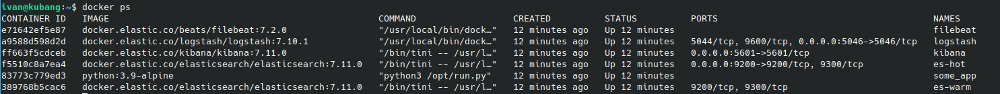
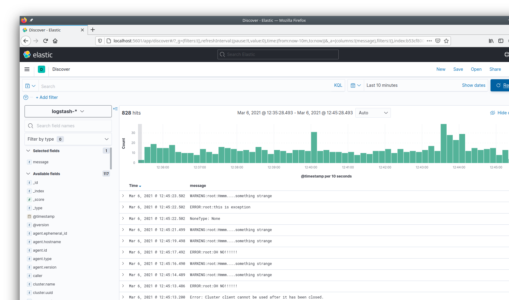

# Домашнее задание к занятию "10.04. ELK"

## Модуль 10. Системы мониторинга

### Студент: Иван Жиляев

## Дополнительные ссылки

>При выполнении задания пользуйтесь вспомогательными ресурсами:
>
>- [поднимаем elk в докер](https://www.elastic.co/guide/en/elastic-stack-get-started/current/get-started-docker.html)
>- [поднимаем elk в докер с filebeat и докер логами](https://www.sarulabs.com/post/5/2019-08-12/sending-docker-logs-to-elasticsearch-and-kibana-with-filebeat.html)
>- [конфигурируем logstash](https://www.elastic.co/guide/en/logstash/current/configuration.html)
>- [плагины filter для logstash](https://www.elastic.co/guide/en/logstash/current/filter-plugins.html)
>- [конфигурируем filebeat](https://www.elastic.co/guide/en/beats/libbeat/5.3/config-file-format.html)
>- [привязываем индексы из elastic в kibana](https://www.elastic.co/guide/en/kibana/current/index-patterns.html)
>- [как просматривать логи в kibana](https://www.elastic.co/guide/en/kibana/current/discover.html)
>- [решение ошибки increase vm.max_map_count elasticsearch](https://stackoverflow.com/questions/42889241/how-to-increase-vm-max-map-count)
>
>В процессе выполнения задания могут возникнуть также не указанные тут проблемы в зависимости от системы.
>
>Используйте output stdout filebeat/kibana и api elasticsearch для изучения корня проблемы и ее устранения.

## Задание повышенной сложности

>Не используйте директорию [help](./help) при выполнении домашнего задания.

## Задание 1

>Вам необходимо поднять в докере:
>- elasticsearch(hot и warm ноды)
>- logstash
>- kibana
>- filebeat
>
>и связать их между собой.
>
>Logstash следует сконфигурировать для приёма по tcp json сообщений.
>
>Filebeat следует сконфигурировать для отправки логов docker вашей системы в logstash.
>
>В директории [help](./help) находится манифест docker-compose и конфигурации filebeat/logstash для быстрого 
>выполнения данного задания.
>
>Результатом выполнения данного задания должны быть:
>- скриншот `docker ps` через 5 минут после старта всех контейнеров (их должно быть 5)
>- скриншот интерфейса kibana
>- docker-compose манифест (если вы не использовали директорию help)
>- ваши yml конфигурации для стека (если вы не использовали директорию help)

Для создания контейнеров воспользовался подготовленными материалами из [help](./help). Для работы всех элементов пришлось сделать следующий доработки:

- для файла [configs/filebeat.yml](configs/filebeat.yml) сменил владельца на _root_ и права доступа на _644_, т.к. такие требования зашиты в самом filebeat и без этого приложение не запускается

- для служб logstash и filebeat добавил сеть _worknet_, т.к. filebeat не могла найти хост _logstash_

- logstash оказался настроен на "мультиконфигурацию" файлом _config/pipelines.yml_ в контейнере и согласно ему конфиги ищутся в расположении `/usr/share/logstash/pipeline/`. Сменил точку монтирования конфиг-файла.

- изменения в конфиге logstash:

    - сменил _input_ с _tcp_ на _beats_, так как в противном случае logstash получал json с неправильной кодировкой поля _message_ (оно состояло из кодов символов неизвестной мне, как и различным "декодерам", кодировки вида `\\x9Di\\x89\\xCBG\\v\\u0003`). Для дебага направлял вывод filebeat напрямую в elasticsearch - документы формируются корректно.

    - конфиг оказался неполным, т.к. в разделе _filter_ в плагине _json_ не было параметров, хотя параметр _source_ для плагина [является обязательным](https://www.elastic.co/guide/en/logstash/current/plugins-filters-json.html#plugins-filters-json-options). Убрал раздел _filter_.

    - в конфиге не работала конструкция `%{[@metadata][indexDate]}` - шаблон текущей даты для формирования имени индекса, т.к. в свойствах `[@metadata]` провайдера _beats_ поля `[indexDate]` нет. Заменил на `%{+yyyy.MM.dd}`, это решение нашёл в [документации](https://www.elastic.co/guide/en/logstash/current/event-dependent-configuration.html#sprintf).

Скриншот `docker ps` через 12 минут после старта проекта:  

Скриншот из kibana:  

После всех правок файлы настроек сервисов были приведены к следующему виду:

- [docker-compose.yml](docker-compose.yml)

- [configs/filebeat.yml](configs/filebeat.yml)

- [configs/logstash.conf](configs/logstash.conf)

- [configs/logstash.yml](configs/logstash.yml)

## Задание 2

>Перейдите в меню [создания index-patterns в kibana](http://localhost:5601/app/management/kibana/indexPatterns/create)
>и создайте несколько index-patterns из имеющихся.
>
>Перейдите в меню просмотра логов в kibana (Discover) и самостоятельно изучите как отображаются логи и как производить 
>поиск по логам.
>
>В манифесте директории help также приведенно dummy приложение, которое генерирует рандомные события в stdout контейнера.
>Данные логи должны порождать индекс logstash-* в elasticsearch. Если данного индекса нет - воспользуйтесь советами 
>и источниками из раздела "Дополнительные ссылки" данного ДЗ.
 
Просмотр логов в kibana изучил самостоятельно.
 